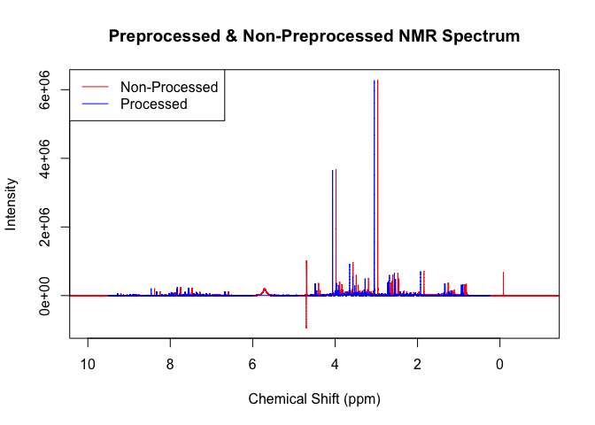
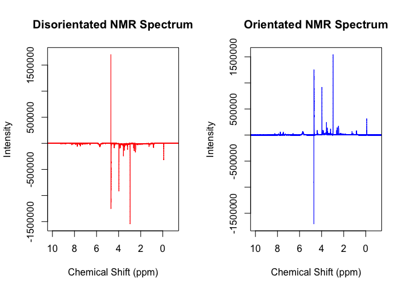

<!-- README.md is generated from README.Rmd. Please edit that file -->

# NMRalter8r

<!-- badges: start -->

NMRalter8r began as part of my honours project where I was trying to
remove the effects of dilution in NMR spectra, especially in urine.
Urine concentrations are highly variable based on a number of factors
such as food and water intake, lifestyle and behaviour, and this
variation interferes with the multivariate statistics used to analyse
NMR spectra. Therefore the goal of NMRalter8r is to calculate the signal
to noise of the spectra and aims to make this constant across all
samples acquired which would remove dilution effects. This is achieved
through automating the NMR and calculating on the fly the number of
scans needed to remove the effects of dilution.

<!-- badges: end -->

## Installation

<!-- You can install the released version of NMRalter8r from [CRAN](https://CRAN.R-project.org) with:-->
<!--``` r-->
<!--install.packages("NMRalter8r")-->
<!--```-->
<!--And-->

Currently NMRalter8r is only available on [GitHub](https://github.com/).
The code to install can be found below.

``` r
# install.packages("devtools")
devtools::install_github("kylebario/NMRalter8r")
```

## The Whole Game

NMRalter8r is not intended to be used by anyone but the NMR. Ideally, it
is installed on the computer of the NMR and then the Jython script that
calls on NMRalter8r is extracted from it and saved in Topspin. From
there, the file can automate the NMR, controlling everything from the
type of experiment performed to the holder position of the sample. This
Jython script is what talks to NMRalter8r and what catches the altered
number of scans once it is calculated. But there is an intended pipeline
to be followed when setting up the script for when Jython parses
NMRalter8r the small scans which can be seen below. Feel free to alter
it how you wish.

## Standard Pipeline

This is the intended pipeline for any altered number of scans
calculations:

``` r
library(NMRalter8r)
readin(path = system.file('extdata/15', package = 'NMRalter8r'))
plot(p,x, xlim = c(10, -1), type = 'l', col='red', main = "Preprocessed & Non-Preprocessed NMR Spectrum", xlab = 'Chemical Shift (ppm)', ylab = 'Intensity')
legend("topleft", legend = c("Non-Processed", "Processed"), col = c("red", "blue"), lty = 1)
pproc(x, p)
points(p,x, xlim = c(10, -1), type = 'l', col='blue')
```



``` r
cr <- crea(x, p, n, c3 = c(3,3.1), c4 = c(4,4.1))
ans <- alter8r(sig = cr, noi = n, goal = 40000, ns = m$a_NS, r2 = c(4, 512, 2))
cat(ans)
#> 8
```

### readin

As you an see, the `readin()` function reads in the NMR spectrum (red)
from the specified path.

### pproc

The `pproc()` function then performs multiple changes to the red
spectrum to create the blue spectrum.  
1. First it calibrates the spectrum to the TSP signal (hence why the
blue spectrum is slightly shift to the left).  
2. Then it removes the lower, water, urea and upper regions of the
spectra (hence why the red spectrum is longer and has those extra peaks
between 4 and 6) that do not mean anything to the analysis.  
3. Thirdly, a baseline correction is performed to remove signals from
large molecules that we do not want to look at.  
4. Finally, a noise estimation is calculated for further use in the
`alter8r()` function as well as others.  
<!-- end of list -->  
This follows the standard pipeline for processing NMR spectra and lays
the foundation for robust anaylsis.

### crea

The `crea()` function then estimates the height of the creatinine peak
within the spectrum to gauge what the signal is.

### alter8r

`alter8r()` is the keystone function of NMRalter8r (as the name
suggests). This function calculates the necessary number of scans need
to be performed on a sample to make it have the set signal to noise. The
function relies on the square root relationship between signal to noise
and the number of scans performed by the NMR.

## Features

NMRalter8r is equipped with a range of preprocessing tools designed to
overcome a number of issues that commonly occur when working with NMR
data.

### Flip

A common problem with NMR spectra acquired with a small number of scans
is that the processing done by Topspin will flip them the wrong way
because the water peak is so much larger than the other peaks.
NMRalter8r contains a function – `flip()` – that checks and corrects for
this:

``` r
library(NMRalter8r)
readin(path = system.file('extdata/4', package = 'NMRalter8r'))
par(mfrow = c(1,2))
plot(p, x, xlim = c(10, -1), type = 'l', col='red', main = "Disorientated NMR Spectrum", xlab = 'Chemical Shift (ppm)', ylab = 'Intensity')
xf <- flip_(x, p, sh = c(3,3.1))
plot(p, xf, xlim = c(10, -1), type = 'l', col='blue', main = "Orientated NMR Spectrum", xlab = 'Chemical Shift (ppm)', ylab = 'Intensity')
```



`flip()` works by multiplying all values within the spectrum by -1 to
reorientate it based on whether or not the creatinine peak (or whatever
peak is between the supply values in the sh argument) has a positive or
negative sum
